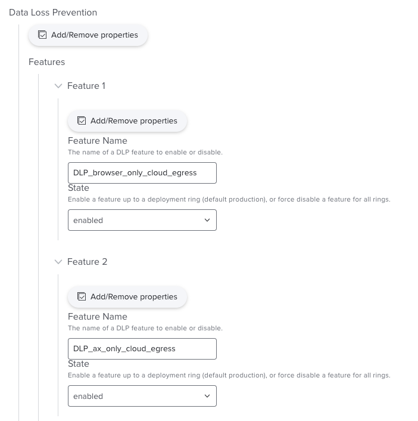

# Cloud Egress Examples

## Browser Only

If you want to restrict CloudEgress enforcement to only the supported browsers, please set following in your com.microsoft.wdav.mobileconfig:

```xml
<key>dlp</key>
<dict>
	<key>features</key>
	<array>
		<dict>
			<key>name</key>
			<string>DLP_browser_only_cloud_egress</string>
			<key>state</key>
			<string>enabled</string>
		</dict>
	</array>
</dict>
```

## AX Only

DLP monitors network traffic to determine the URLs processes are communicating with.  For browsers, this can cause FPs in reporting as DLP cannot uniquely identify the actual network connection associated with a particular file event.  This config can be set to make DLP rely only on UX tree traversal to identify the URL.  In that case, the URL from the address bar will be used by DLP instead of network information.  (This may result in FNs)

```xml
<key>dlp</key>
<dict>
	<key>features</key>
	<array>
		<dict>
			<key>name</key>
			<string>DLP_ax_only_cloud_egress</string>
			<key>state</key>
			<string>enabled</string>
		</dict>
	</array>
</dict>
```

## Examples

### Intune

This sample configuration profile sets both the Browser Only and AX Only flags for cloud egress: [com.microsoft.wdav.mobileconfig](./com.microsoft.wdav.mobileconfig).

### JAMF Pro

**Using schema.json**

Modify the existing MDE Prefereneces Configuration Profile to use the latest version of [schema.json](/macos/schema/schema.json). Then add the `Data Loss Prevention` key, and `Features` subkey.  Add the individual features here.



**Using plist**

This sample plist sets both the Browser Only and AX Only flags for cloud egress: [com.microsoft.wdav.plist](./com.microsoft.wdav.plist).